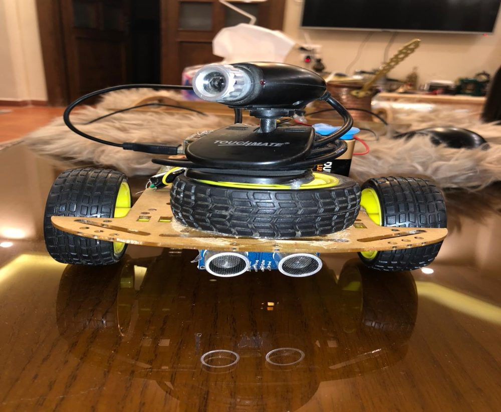
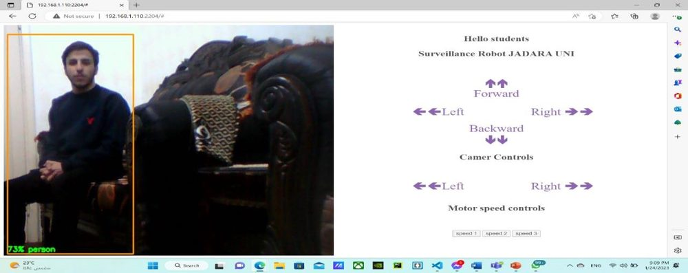
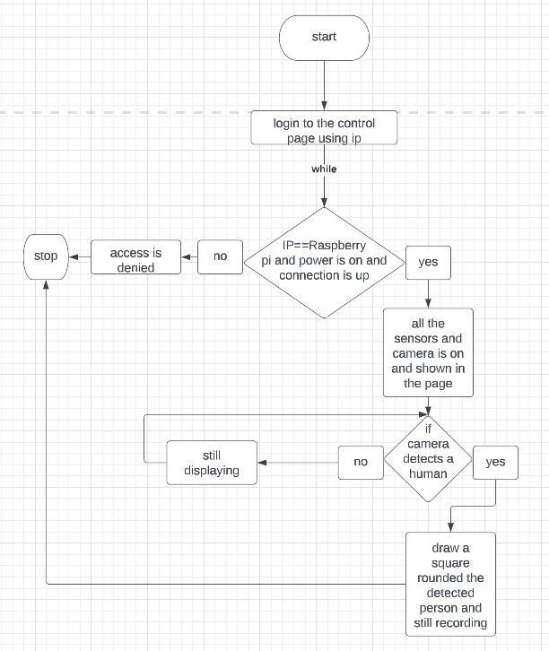
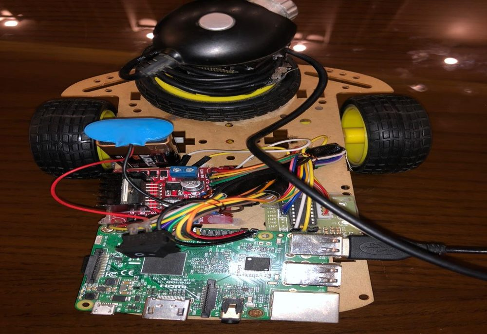
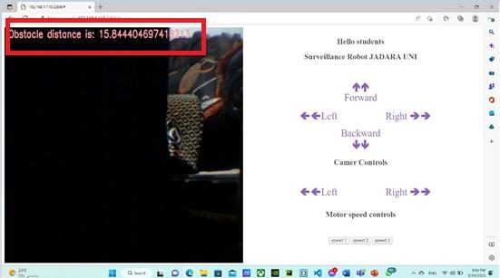

# Raspberry Pi Human Detection Robot

**English** | [日本語](#日本語)

A remote-controlled, car-shaped robot that detects people in real time on a Raspberry Pi and streams live video to a web control page.

Bachelor's graduation project, Software Engineering, Jadara University (Oct 2022 – Jan 2023). Team of three. I was the team leader: I split and scheduled the work, contributed to the code, and wrote the full project report.

<p align="center">
  
  
</p>

## Why

Rescue teams sometimes risk their lives searching collapsed or burning buildings, only to find nobody inside. Border patrols have long lines to watch with few people. A small robot can go first, look for people, and report back through a camera.

## What it does

- **Live person detection** on the robot itself, using MobileNet SSD v2 (COCO, quantized TensorFlow Lite). The detected person gets a bounding box and a confidence score.
- **Live video** streamed to the browser (MJPEG over Flask).
- **Web control page**: drive forward, backward, left and right, stop, rotate the camera, and choose one of three speeds.
- **Obstacle distance**: an ultrasonic sensor measures the distance and shows it on the video. The robot refuses to move forward when an obstacle is closer than 5 cm.
- **Starts on boot**: the code runs as soon as the robot is powered on.

## Key decisions

| Decision | Why |
|---|---|
| **Raspberry Pi 3 Model B**, not Arduino | It runs Python, computer vision, and a web server on the same board. An Arduino doesn't have the memory or CPU for that. |
| **MobileNet SSD v2, quantized TFLite** | We compared it with CenterNet, EfficientDet, and R-CNN. MobileNet is light enough to run in real time on the Pi's CPU, with better accuracy and lower latency than MobileNet v1. |
| **Track only `person`, show one box** (`top_k = 1`) | Less drawing and less work per frame, so the stream stays smoother on weak hardware. |
| **Flask + MJPEG streaming** | Any browser can open the page, with no app to install. |
| **PWM speed control** (50 / 75 / 100 % duty cycle) | Three simple speed levels that are easy to control from a button. |

## How it works

<p align="center"></p>

1. The camera captures a frame. OpenCV converts it from BGR to RGB.
2. The TFLite interpreter runs MobileNet SSD on the frame.
3. If a person is found, a box and score are drawn on the frame.
4. The ultrasonic sensor reads the distance. If an obstacle is near, the distance is written on the frame.
5. The frame is encoded as JPEG and streamed to the page at `/video_feed`.
6. Buttons on the page call Flask routes that set the GPIO pins for the DC motors, the stepper motor (camera), and PWM (speed).

## Hardware

<p align="center"></p>

| Part | Use | GPIO (BCM) |
|---|---|---|
| Raspberry Pi 3 Model B | Main controller | — |
| USB camera | Video and detection | — |
| 2 DC motors + L298N driver | Driving | IN 11, 8, 9, 10 · EN 21, 20 (PWM) |
| Stepper motor + driver board | Camera rotation (quarter turn per press) | 17, 18, 27, 22 |
| HC-SR04 ultrasonic sensor | Obstacle distance | Trigger 25 · Echo 24 |

Total hardware cost: about 195 JOD.

## Run it

```bash
pip install -r requirements.txt
# Put app.py, common.py, the .tflite model and coco_labels.txt in /home/pi/Desktop/Project
python3 app.py
# Open http://<raspberry-pi-ip>:2204 from a device on the same network
```

## Results and limits

The robot detected people, streamed live video, measured obstacle distance, and was fully controllable from the web page.

<p align="center"></p>

What didn't work as planned, mostly because of the budget:

- **Remote control over the internet (WAN)** needed a static IP and a public server, which we couldn't pay for. Control works only on the same network.
- **Stream latency** because of the low-cost camera and the Pi's CPU.
- **Distance readings** were sometimes wrong when the stream lagged.
- **Speed** was not always steady because of battery quality.

## Looking back (2026)

If I built this again today, I would:

- **Reach it from anywhere with no public IP**, using a secure tunnel such as Tailscale or Cloudflare Tunnel. This solves our biggest limit at almost no cost.
- **Run detection in its own thread**, so the video, the sensor, and the motors don't wait for each other.
- **Use WebRTC** instead of MJPEG for lower video latency.
- **Add a Coral Edge TPU**: `common.py` already supports the Edge TPU delegate (`load_model(..., edgetpu=1)`), so inference could get much faster with no code rewrite.
- **Save a snapshot and the GPS location** when a person is detected, so a rescue team gets an alert and doesn't have to watch the stream all the time.

This project is where I first ran AI on a small device with limited resources. I'm now continuing that idea in my master's research, using a small local LLM that works offline.

## Repository

```
app.py                  Flask server, routes, GPIO control, detection loop
common.py               TFLite helpers (load model, input, output, Edge TPU option)
templates/index.html    Control page (rebuilt in 2026; the original HTML was lost)
coco_labels.txt         COCO class labels
mobilenet_ssd_v2_coco_quant_postprocess.tflite   Detection model
docs/images/            Photos and diagrams from the project report
```

---

## 日本語

Raspberry Pi上でリアルタイムに人を検知し、映像をWebの操作画面に配信する、遠隔操作型の車型ロボットです。

ジャダラ大学ソフトウェア工学部の卒業研究（2022年10月〜2023年1月）、3人チームで開発しました。私はチームリーダーとして、タスクの分担とスケジュール管理、実装、報告書の執筆を担当しました。

### 目的

救助隊が危険を冒して倒壊・火災現場を捜索しても、要救助者がいないことがあります。また、長い国境線を少人数で監視するのは困難です。小型ロボットが先に入って人の有無を確認できれば、こうしたリスクと負担を減らせます。

### 主な機能

- **リアルタイム人検知**：MobileNet SSD v2（COCO、量子化済みTensorFlow Lite）をロボット本体で実行
- **ライブ映像配信**：FlaskによるMJPEGストリーミング
- **Web操作画面**：前進・後退・左右・停止、カメラの回転、3段階の速度変更
- **障害物の距離表示**：超音波センサーで距離を測り、5cm未満では前進しない
- **自動起動**：電源を入れるとプログラムが起動

### 技術的な判断

| 判断 | 理由 |
|---|---|
| ArduinoではなくRaspberry Pi 3 | Python、画像処理、Webサーバーを1台で動かせるため |
| 量子化済みMobileNet SSD v2 | CenterNet、EfficientDet、R-CNNと比較し、Piの CPUでもリアルタイムで動く軽さを重視 |
| 「人」のみ・表示1件に限定 | 1フレームあたりの処理を減らし、映像を滑らかに保つため |
| Flask + MJPEG | アプリ不要で、どのブラウザからも操作できるため |

### 成果と課題

人検知、映像配信、距離計測、Webからの遠隔操作をすべて実現しました。一方、予算の制約から固定IPとサーバーを用意できず、操作は同一ネットワーク内に限られました。また、低価格カメラによる映像の遅延も課題として残りました。

### 今振り返ると（2026年）

- TailscaleやCloudflare Tunnelを使えば、固定IPなしで安全に外部から操作できる
- 検知処理を別スレッドに分け、映像・センサー・モーターが互いを待たないようにする
- MJPEGの代わりにWebRTCで遅延を減らす
- `common.py`は既にCoral Edge TPUに対応しているため、ハードウェアを追加するだけで推論を高速化できる
- 人を検知したら画像と位置情報を保存し、救助隊に通知する

このプロジェクトで初めて「限られた資源の端末でAIを動かす」経験をしました。現在は、その考えを修士研究で、オフラインで動作する小型ローカルLLMの活用へとつなげています。
